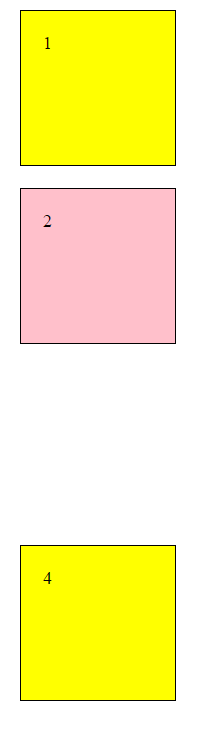

# Opgave i Box-model

Dan en ny index.html med følgende indhold:

```html
<!DOCTYPE html>
<html lang="en">
  <head>
    <meta charset="UTF-8" />
    <meta name="viewport" content="width=device-width, initial-scale=1.0" />
    <meta http-equiv="X-UA-Compatible" content="ie=edge" />
    <title>Document</title>
  </head>
  <body>
    <div>1</div>
    <div>2</div>
    <div>3</div>
    <div>4</div>
  </body>
</html>

```

Du skal tilføje en tilføje en style.css og sørge for, at 

- alle div's har en højde og bredde på 100px
- alle div's har en margin på 20px
- alle div's har en padding på 20px
- alle div's har en border på 1px solid black
- alle div's har en gul baggrundsfarve
  - bortset fra den nr 2 - den skal være pink
- div nr 3 skal ikke være synlig
  - prøv både visibility: hidden og display: none og se forskel
  
Det skal se nogenlunde således ud:



Se evt min løsning - [html](index.html) og [css](style.css).