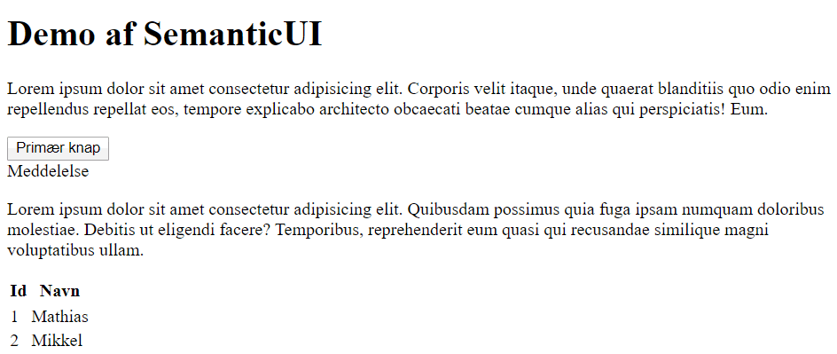
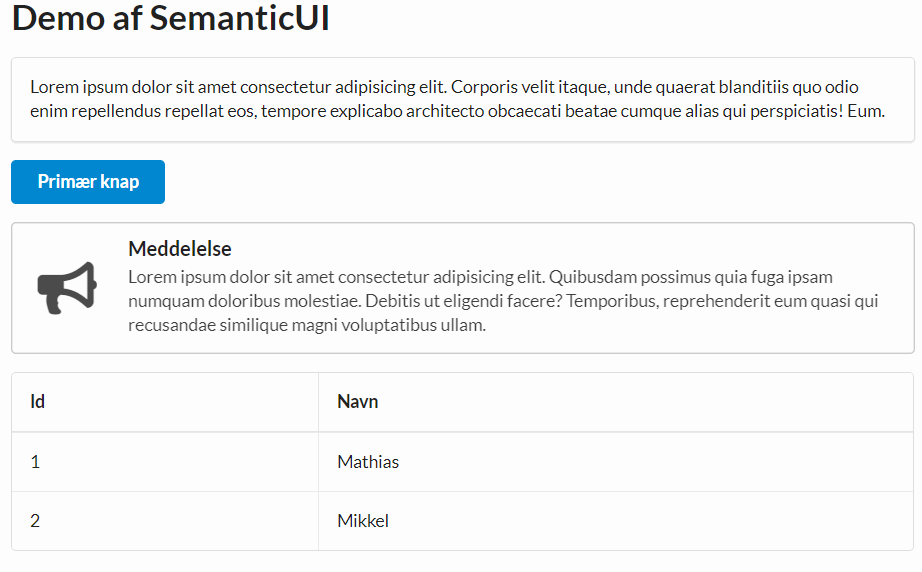

# Opgave i brug af CSS Framework

I denne opgave skal du få denne html:

```html
<!DOCTYPE html>
<html lang="en">
  <head>
    <meta charset="UTF-8" />
    <title>Document</title>
    <meta name="viewport" content="width=device-width, initial-scale=1.0" />
  </head>
  <body>
    <div>
      <h1>Demo af SemanticUI</h1>
      <div>
        <p>Lorem ipsum dolor sit amet consectetur adipisicing elit. Corporis velit itaque, unde quaerat blanditiis quo odio enim repellendus repellat eos, tempore explicabo architecto obcaecati beatae cumque alias qui perspiciatis! Eum.</p>
      </div>
      <div>
        <button>
          Primær knap
        </button>
      </div>
      <div>
        <div>
          <div>
            Meddelelse
          </div>
          <p>Lorem ipsum dolor sit amet consectetur adipisicing elit. Quibusdam possimus quia fuga ipsam numquam doloribus molestiae. Debitis ut eligendi facere? Temporibus, reprehenderit eum quasi qui recusandae similique magni voluptatibus ullam.</p>
        </div>
      </div>
      <div>
        <table>
          <thead>
            <tr>
              <th>Id</th>
              <th>Navn</th>
            </tr>
          </thead>
          <tr>
            <tr>
              <td>1</td>
              <td>Mathias</td>
            </tr>
            <tr>
              <td>2</td>
              <td>Mikkel</td>
            </tr>
          </tr>
        </table>
      </div>
    </div>
  </body>
</html>
```

som renderes til 



til at se således ud



ved hjælp af SemanticUI (https://semantic-ui.com/).

Du kan linke SemanticUI direkte fra et CDN

```
https://cdnjs.cloudflare.com/ajax/libs/semantic-ui/2.4.1/semantic.min.css
```

og finde hints/dokumentation til de forskellige sektioner her:

- Tilføj alt (den yderste div) til en [container](https://semantic-ui.com/elements/container.html) (class="ui container")
- Tilføj [header](https://semantic-ui.com/elements/header.html) til h1 
- Tilføj [segment](https://semantic-ui.com/elements/segment.html) til paragraf
- Tilføj [primary button](https://semantic-ui.com/elements/button.html) til knap
- Tilføj [icon message](https://semantic-ui.com/collections/message.html#icon-message) til meddelelse
- Tilføj [table celled padded](https://semantic-ui.com/collections/table.html#table) til table

Se min [løsning](index.html) og prøv dig frem med andre muligheder for design.