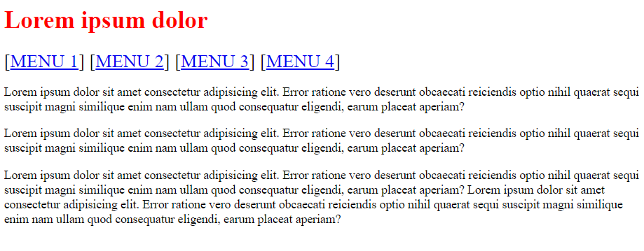
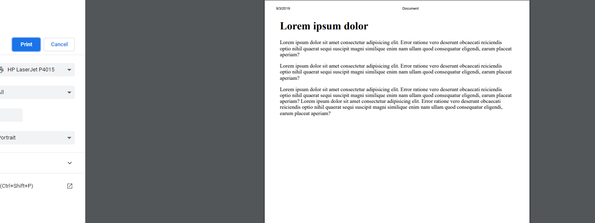

# Brug af media type

I denne opgave skal du prøve at lege med den simple form for dynamisk css. Start med at skabe en tom html-side med følgende indhold:

```html
<!DOCTYPE html>
<html lang="en">
<head>
    <meta charset="UTF-8">
    <meta name="viewport" content="width=device-width, initial-scale=1.0">
    <meta http-equiv="X-UA-Compatible" content="ie=edge">
    <link rel="stylesheet" href="style.css">
    <title>Document</title>
</head>
<body>
    <h1>Lorem ipsum dolor</h1>
    <div class="menu">
        [<a href="#">Menu 1<a/>] [<a href="#">Menu 2<a/>] [<a href="#">Menu 3<a/>] [<a href="#">Menu 4<a/>]
    </div>
    <p>Lorem ipsum dolor sit amet consectetur adipisicing elit. Error ratione vero deserunt obcaecati reiciendis optio nihil quaerat sequi suscipit magni similique enim nam ullam quod consequatur eligendi, earum placeat aperiam?</p>
    <p>Lorem ipsum dolor sit amet consectetur adipisicing elit. Error ratione vero deserunt obcaecati reiciendis optio nihil quaerat sequi suscipit magni similique enim nam ullam quod consequatur eligendi, earum placeat aperiam?</p>
    <p>Lorem ipsum dolor sit amet consectetur adipisicing elit. Error ratione vero deserunt obcaecati reiciendis optio nihil quaerat sequi suscipit magni similique enim nam ullam quod consequatur eligendi, earum placeat aperiam? Lorem ipsum dolor sit amet consectetur adipisicing elit. Error ratione vero deserunt obcaecati reiciendis optio nihil quaerat sequi suscipit magni similique enim nam ullam quod consequatur eligendi, earum placeat aperiam?</p>
</body>
</html>
```
og følgende css

```css
h1{
    color: red;
}

.menu {
    text-transform: uppercase;
    font-size: 1.5em;
}
```

Se siden gennem live server - den burde se nogenlunde således ud:



Dit job er nu at sørge for at tilføje CSS til style.css således, at overskrift ændres til sort skrift og menu skjules når der printes (se resultat i Chrome's preview print ved at trykke ctrl+p). Brug ```css@Media print``` til at skabe et "print-view".



Se evt min løsning - [html](index.html) og [css](style.css).